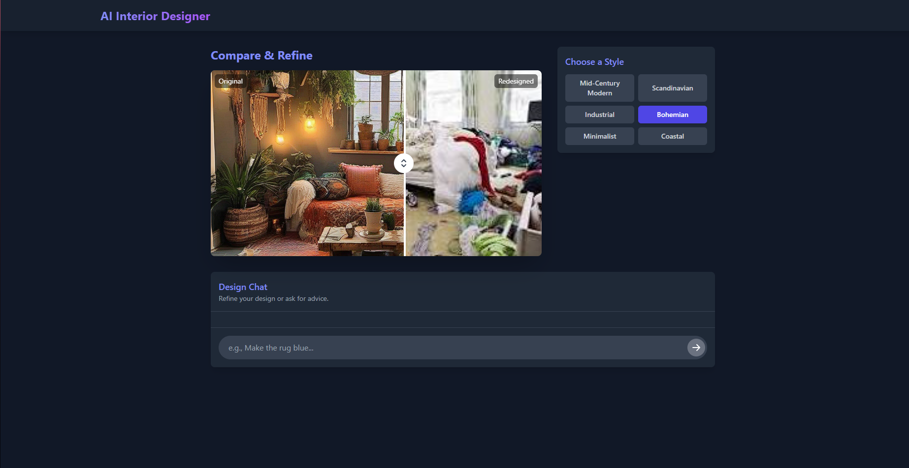

# AI Interior Design Consultant

An intelligent web application that transforms interior design spaces using AI. Upload a photo of your room and get AI-generated redesigns in different interior design styles with expert advice.



## ✨ Features

- 🏠 **Upload Room Photos**: Start by uploading a photo of your room
- 🎨 **AI-Powered Style Transformations**: Transform your room into different interior design styles:
  - Mid-Century Modern
  - Scandinavian
  - Industrial
  - Bohemian
  - Minimalist
  - Coastal

- 💬 **Design Chat**: Get expert interior design advice and suggestions
- 🔄 **Compare & Refine**: Side-by-side comparison of original and redesigned rooms
- ✨ **Visual Modifications**: Ask for specific changes (e.g., "Make the sofa blue", "Add more plants")

## 🛠️ Tech Stack

- **Frontend**: React 19 + TypeScript + Vite
- **Backend**: Express.js (Node.js)
- **AI Models**: 
  - Image Generation: Stable Diffusion XL (`stabilityai/stable-diffusion-xl-base-1.0`)
  - Text Generation: Mistral 7B (`mistralai/Mistral-7B-Instruct-v0.1`)
- **API Provider**: Hugging Face Inference API
- **HTTP Client**: node-fetch

## 📁 Project Structure

```
├── index.tsx                 # App entry point
├── App.tsx                   # Main React component
├── vite.config.ts           # Vite configuration with API proxy
├── tsconfig.json            # TypeScript configuration
├── package.json             # Dependencies and scripts
├── .env                      # Environment variables (API key)
├── .gitignore               # Git ignore file
├── server/
│   └── server.js            # Express API server
├── services/
│   ├── geminiService.ts     # Legacy Gemini service (kept for reference)
│   └── huggingfaceService.ts # Hugging Face service proxy
├── components/
│   ├── Header.tsx           # App header
│   ├── ImageUploader.tsx    # Image upload component
│   ├── StyleSelector.tsx    # Design style buttons
│   ├── ImageComparator.tsx  # Side-by-side image comparison
│   ├── ChatInterface.tsx    # Chat UI
│   └── Spinner.tsx          # Loading spinner
├── types.ts                 # TypeScript type definitions
├── constants.ts             # App constants (design styles, etc.)
└── README.md                # This file
```

## 🚀 Quick Start

### Prerequisites
- Node.js 16+ and npm
- Hugging Face account with API token
- Modern web browser

### 1. Install Dependencies

```bash
cd ai-interior-design-consultant
npm install
npm install --save @huggingface/inference
```

### 2. Get a Hugging Face API Token

1. Go to [huggingface.co](https://huggingface.co)
2. Sign up or log in
3. Go to [Settings → Access Tokens](https://huggingface.co/settings/tokens)
4. Click "New token"
5. Create a fine-grained token with `Make calls to Inference Providers` permission
6. Copy the token

### 3. Configure Environment

Create `.env` file in project root:

```env
API_KEY=hf_YOUR_TOKEN_HERE
PORT=5000
```

⚠️ **Never commit `.env`** - it's in `.gitignore`

### 4. Start the Application

**Terminal 1 - API Server:**
```bash
npm run start:server
```
Server runs on `http://localhost:5000`

**Terminal 2 - Frontend Dev Server:**
```bash
npm run dev
```
App runs on `http://localhost:3000`

## 📖 How to Use

1. **Upload a Photo**: Upload a room photo
2. **Select a Style**: Choose from 6 interior design styles
3. **Wait for Generation**: AI generates redesigns for each style
4. **Compare**: View original vs redesigned side-by-side
5. **Chat**: Ask for specific modifications or design advice

## 🔌 API Endpoints

### Generate Image
```
POST /api/generate-image
Content-Type: application/json

{
  "prompt": "Mid-Century Modern",
  "isRefinement": false
}
```

### Chat
```
POST /api/chat
Content-Type: application/json

{
  "style": "Mid-Century Modern",
  "message": "Make the sofa blue"
}
```

### Health Check
```
GET /health
```

## ⚙️ Configuration

| Variable | Default | Description |
|----------|---------|-------------|
| `API_KEY` | (required) | Hugging Face API token |
| `PORT` | 5000 | API server port |

## 🎨 Available Design Styles

- **Mid-Century Modern**: Retro-futuristic, clean lines, warm woods
- **Scandinavian**: Minimalist, light, cozy, functional
- **Industrial**: Raw materials, exposed elements, modern-rustic
- **Bohemian**: Eclectic, colorful, artistic, global influences
- **Minimalist**: Clean, spacious, neutral, essential only
- **Coastal**: Beach-inspired, light, airy, natural materials

## 🤖 AI Models

### Image Generation
- **Model**: `stabilityai/stable-diffusion-xl-base-1.0`
- **Provider**: Hugging Face Inference API

### Text Generation
- **Model**: `mistralai/Mistral-7B-Instruct-v0.1`
- **Provider**: Hugging Face Inference API

## 🐛 Troubleshooting

### "API_KEY not configured"
- Verify `.env` file exists and has correct key
- Restart both servers

### "500 Internal Server Error"
- Check server logs
- Verify API key is valid
- Check Hugging Face quota

### "Image generation is slow"
- First request to a model takes longer
- Free tier has rate limits

### Models not available
- Check [Hugging Face Model Hub](https://huggingface.co/models)
- Update model names in `server/server.js` if needed

## 📝 Scripts

```bash
npm run dev              # Start Vite dev server (port 3000)
npm run start:server     # Start Express API server (port 5000)
npm run build           # Build for production
npm run preview         # Preview production build
```

## 🔄 Architecture

```
Browser (React)
    ↓ (HTTP via Vite proxy /api → localhost:5000)
Express API Server
    ↓ (Hugging Face SDK)
Hugging Face Inference API
    ↓
Stable Diffusion XL (images)
Mistral 7B (text)
```

The Vite dev server proxies `/api/*` requests to the Express backend, allowing development without CORS issues.

## ⚡ Performance Optimizations

- Parallel style generation
- Per-style error isolation
- Automatic retry on rate limit
- HTTP status code mapping (401, 429, 502)

## 📚 Learning Resources

- [Hugging Face API Docs](https://huggingface.co/docs/api-inference/index)
- [React Documentation](https://react.dev)
- [Express.js Guide](https://expressjs.com)
- [Vite Documentation](https://vitejs.dev)

## 🚧 Future Enhancements

- [ ] Multi-image variations
- [ ] Save/download designs
- [ ] Share designs
- [ ] User accounts & history
- [ ] Advanced style customization
- [ ] 3D preview
- [ ] Budget-friendly products

## 📄 License

See LICENSE file.

## 💬 Support

For issues:
1. Check troubleshooting section
2. Review API documentation
3. Check console/server logs

---

**Made with ❤️ using React & AI**
